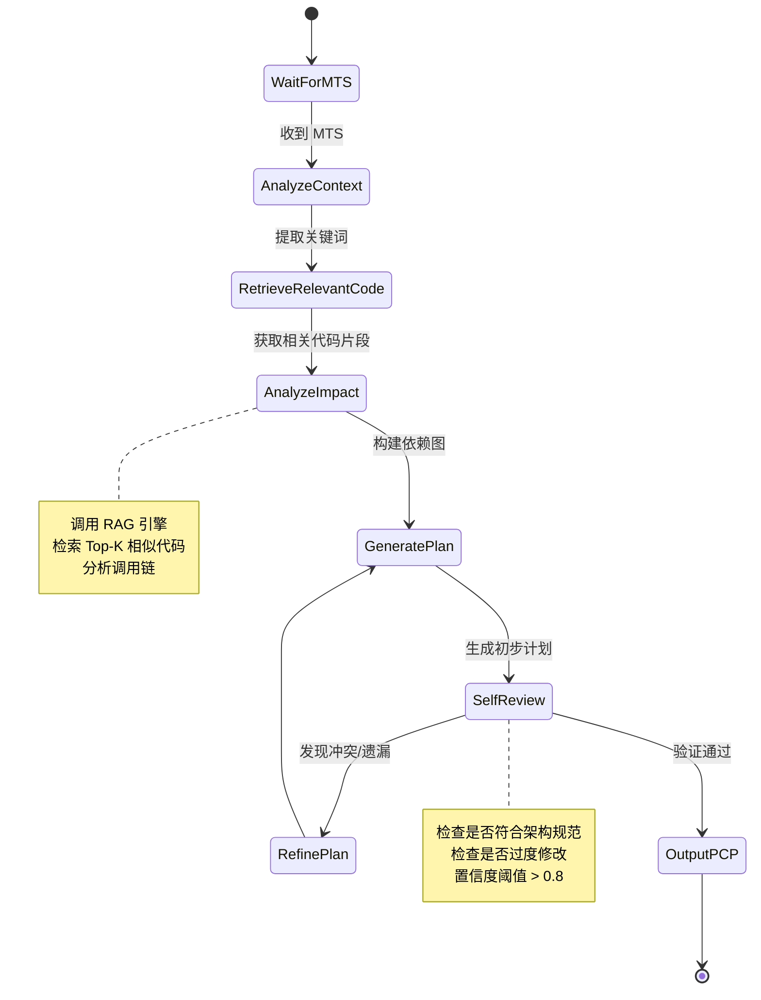

# Architect Agent 详细设计

## 1. 角色定位
**Architect Agent** 是系统的"技术大脑"，负责将 PM Agent 输出的《机器任务书 (MTS)》转化为可执行的《精准改动计划 (Precision Change Plan, PCP)》。它不直接写代码，而是通过 **RAG (检索增强生成)** 全局扫描现有代码库，定位受影响的模块，制定最小化修改策略，避免"牵一发而动全身"的副作用。

---

## 2. 核心职责
1. **上下文感知**: 理解 MTS 中的业务目标与技术约束。
2. **全局代码扫描**: 利用向量索引检索与需求相关的现有代码文件、接口定义、数据模型。
3. **影响面分析**: 识别修改点可能波及的依赖模块（调用链分析）。
4. **方案生成**: 输出具体的文件级修改计划（新增/修改/删除），精确到函数/类级别。
5. **技术选型建议**: 针对新需求推荐合适的内部库或设计模式。
6. **边界界定**: 明确划定"不做什幺"，防止范围蔓延。

---

## 3. 输入与输出

### 3.1 输入 (Input)
- **机器任务书 (MTS)**: 来自 PM Agent，包含功能需求、验收标准、非功能约束。
- **代码库索引 (Codebase Index)**: 预构建的向量数据库，包含项目所有源代码的 Embedding。
- **架构规范文档**: 项目的分层架构定义、命名规范、禁止使用的 API 列表。
- **历史变更案例**: 类似需求的历史实现方案（Few-shot 参考）。

### 3.2 输出 (Output) - 《精准改动计划 (PCP)》
```json
{
  "plan_id": "arch_20231027_001",
  "summary": "实现用户积分抵扣功能，涉及 OrderService 和 UserService 修改",
  "confidence_score": 0.92,
  "changes": [
    {
      "file_path": "src/services/order_service.py",
      "action": "MODIFY",
      "target_scope": ["calculate_total", "apply_discount"],
      "reason": "需要增加积分抵扣逻辑到总价计算中",
      "dependencies": ["src/models/user_points.py"]
    },
    {
      "file_path": "src/models/user_points.py",
      "action": "CREATE",
      "target_scope": ["UserPoints", "deduct_points"],
      "reason": "新增积分数据模型与扣减方法",
      "dependencies": []
    }
  ],
  "risk_analysis": [
    {"file": "src/api/order_api.py", "risk": "高", "note": "需确认前端是否兼容新的返回结构"}
  ],
  "excluded_files": ["src/legacy/*"], 
  "tech_stack_recommendation": ["使用现有的 PaymentStrategy 模式"]
}
```

---

## 4. 工作流程 (State Machine)



### 详细步骤说明：
1. **语义解析**: 从 MTS 提取关键技术实体（如"积分"、"订单"、"并发"）。
2. **混合检索 (Hybrid Search)**:
   - **关键词搜索**: 匹配文件名、类名、函数名。
   - **向量搜索**: 匹配语义相似的代码逻辑（即使变量名不同）。
3. **上下文重组**: 将检索到的代码片段与其所在的文件路径、依赖关系重组为完整的上下文窗口。
4. **推理与规划**:
   - LLM 基于上下文思考："要实现这个功能，我需要改哪里？"
   - 应用思维链 (CoT): "修改 A 会影响 B，所以需要同时检查 B..."
5. **规范校验**: 对照架构规范文档，剔除违规方案（如：禁止在 Controller 层直接访问 DB）。
6. **输出生成**: 格式化输出 PCP JSON。

---

## 5. 关键技术实现

### 5.1 代码库向量化策略 (Indexing Strategy)
- **切片粒度**: 以"函数/类"为单位进行切片，保留完整的导入语句和类定义上下文。
- **元数据增强**: 每个切片附带 `file_path`, `line_number`, `imports`, `called_by`, `calls` 等元数据。
- **更新机制**: 监听 Git 提交事件，增量更新向量索引。

### 5.2 检索增强 (RAG) 优化
- **多路召回**: 结合 BM25 (关键词) + Dense Vector (语义) + Graph (调用链)。
- **重排序 (Re-ranking)**: 使用 Cross-Encoder 对召回结果进行相关性重排序，取 Top-10 作为 LLM 输入。
- **上下文压缩**: 使用 LLM 摘要无关代码，只保留关键签名和逻辑注释，节省 Token。

### 5.3 影响面分析算法
- **静态分析辅助**: 利用 Tree-sitter 解析 AST，构建轻量级调用图 (Call Graph)。
- **图遍历**: 从检索到的核心节点出发，向上遍历调用者（影响面），向下遍历被调用者（依赖面）。
- **剪枝策略**: 忽略测试文件、配置文件中非核心逻辑的引用。

---

## 6. Prompt 工程设计

### System Prompt 核心片段
```text
你是一位拥有 20 年经验的首席软件架构师。你的任务是根据《机器任务书》制定精准的代码修改计划。
原则：
1. 最小化修改：能改 3 个文件绝不碰第 4 个。
2. 尊重现有架构：严禁破坏现有的分层和依赖关系。
3. 明确边界：明确指出哪些文件不需要修改。
4. 风险前置：识别潜在的破坏性变更。

输入：
- 用户需求 (MTS)
- 相关代码片段 (Context)
- 架构规范 (Constraints)

输出格式：严格的 JSON 结构，包含文件路径、操作类型、修改理由。
```

### Few-shot 示例
提供 2-3 个历史高质量案例：
- **Case 1**: 新增支付渠道 -> 修改 Strategy 工厂类，新增具体实现类，未触碰核心订单逻辑（正面案例）。
- **Case 2**: 修复登录 Bug -> 错误地重构了整个 Auth 模块导致回归故障（反面案例，用于警示）。

---

## 7. 异常处理与自愈

| 异常场景 | 检测机制 | 处理策略 |
| :--- | :--- | :--- |
| **检索结果为空** | RAG 返回相似度 < 0.3 | 触发"全库扫描"模式或请求人工补充背景知识 |
| **架构冲突** | 计划违反规范文档 | 自动回退重新生成，并在 Prompt 中高亮冲突点 |
| **置信度过低** | Self-Review 评分 < 0.7 | 挂起任务，生成"架构咨询单"发送给人类架构师 |
| **循环依赖风险** | 检测到新的循环引用 | 拒绝该方案，尝试引入中间层或事件解耦 |

---

## 8. 性能指标 (SLA)

- **响应时间**: 平均 < 45 秒 (含 RAG 检索与 LLM 推理)
- **定位准确率**: 推荐修改文件的召回率 > 95%
- **幻觉率**: 推荐不存在的文件或 API 的比例 < 1%
- **规范遵从度**: 输出方案符合架构规范的比例 > 98%

---

## 9. 与上下游交互

- **上游 (PM Agent)**:
  - 接收 MTS。
  - 若 MTS 技术可行性存疑，反馈"技术阻碍报告"给 PM。
- **下游 (Dev Agent)**:
  - 交付 PCP (JSON)。
  - Dev Agent 严格按 PCP 指定的文件和范围执行代码生成，不得越界。
- **侧向 (Senior Agent)**:
  - PCP 将作为 Senior Agent 审查的首要依据（先审设计，再审代码）。

---

## 10. 技术栈推荐
- **LLM**: Claude 3.5 Sonnet (长上下文优势，适合阅读大量代码) 或 GPT-4o。
- **Vector DB**: Qdrant 或 Milvus (支持混合搜索与元数据过滤)。
- **Code Parser**: Tree-sitter (高性能增量解析)。
- **Graph DB**: Neo4j (可选，用于存储复杂的项目调用图谱)。
- **Orchestration**: LangGraph 或 Temporal.io。
