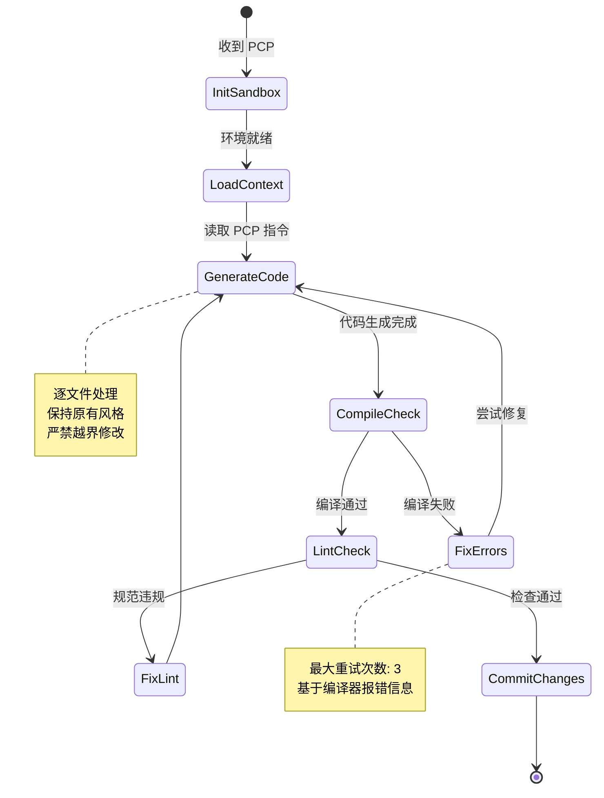

# Dev Agent 详细设计

## 1. 角色定位
**Dev Agent** 是系统的"代码执行者"，负责将 Architect Agent 输出的《精准改动计划 (PCP)》转化为实际的生产代码。它在 **Docker 隔离沙箱** 中运行，严格遵循 PCP 划定的文件范围和逻辑边界，确保修改的精准性和安全性。

---

## 2. 核心职责
1. **环境准备**: 拉取代码仓库，在 Docker 沙箱中复现与 CI/CD 一致的开发环境。
2. **代码生成**: 根据 PCP 指令，对指定文件进行新增、修改或删除操作。
3. **局部编译**: 仅编译受影响的模块，快速验证语法正确性。
4. **自我修正**: 捕获编译错误并自动修复，形成"生成 - 编译 - 修复"的微循环。
5. **变更提交**: 生成 Git Commit，关联任务 ID，推送至临时分支。

---

## 3. 输入与输出

### 3.1 输入 (Input)
- **精准改动计划 (PCP)**: 来自 Architect Agent，包含文件路径、操作类型、目标函数、修改理由。
- **源代码仓库**: 只读挂载的原始代码库。
- **开发环境配置**: `Dockerfile`, `requirements.txt`, `pom.xml` 等依赖定义。
- **编码规范**: Lint 规则 (ESLint, Pylint, CheckStyle)、命名约定。

### 3.2 输出 (Output)
- **修改后的代码文件**: 应用了 PCP 变更的实际源码。
- **编译日志**: 局部构建的成功/失败记录。
- **Git Diff**: 具体的代码变更片段，用于后续 Review。
- **自检报告**: 代码是否符合 Lint 规范的自查结果。

```json
{
  "task_id": "dev_20231027_001",
  "status": "SUCCESS",
  "modified_files": [
    {
      "path": "src/services/order_service.py",
      "lines_added": 15,
      "lines_removed": 3,
      "compile_status": "PASS"
    },
    {
      "path": "src/models/user_points.py",
      "lines_added": 42,
      "lines_removed": 0,
      "compile_status": "PASS"
    }
  ],
  "lint_errors": [],
  "git_commit_hash": "a1b2c3d4",
  "sandbox_log_url": "http://logs/sandbox/dev_001.log"
}
```

---

## 4. 工作流程 (State Machine)



### 详细步骤说明：
1. **沙箱初始化**:
   - 启动 Docker 容器，挂载代码库（只读）和工作目录（读写）。
   - 安装项目依赖，确保环境与生产一致。
2. **上下文加载**:
   - 读取 PCP 中指定的文件内容。
   - 加载相关依赖文件的接口定义（Interface），确保调用兼容。
3. **增量代码生成**:
   - **策略**: 采用"外科手术式"修改，仅替换 PCP 指定的函数/类，保留其他代码原样。
   - **工具**: 使用 AST (抽象语法树) 操作库 (如 Python 的 `ast` 模块，Java 的 `JDT`) 进行精准插入/替换，避免正则替换的不稳定性。
4. **即时编译验证**:
   - 执行 `mvn compile -pl <module>` 或 `tsc --noEmit` 等命令。
   - 解析编译器报错信息，定位错误行号。
5. **自动修复循环**:
   - 若编译失败，将报错信息反馈给 LLM，要求重新生成该片段。
   - 限制重试次数 (默认 3 次)，超时则上报异常。
6. **代码规范检查**:
   - 运行 Linter 工具，确保缩进、命名、导入顺序符合团队规范。
7. **提交变更**:
   - 执行 `git add`, `git commit -m "feat: [TaskID] 实现积分抵扣功能"`。
   - 推送至远程临时分支 `feature/auto/task-xxx`。

---

## 5. 关键技术实现

### 5.1 沙箱隔离技术 (Sandboxing)
- **Docker 容器**: 每个任务独享一个容器，防止文件冲突和环境污染。
- **资源限制**: 限制 CPU (2 核) 和内存 (4GB)，防止死循环或内存泄漏。
- **网络隔离**: 默认禁止外网访问，仅允许连接内部 Maven/NPM 镜像源和数据库 Mock 服务。
- **文件系统保护**: 源代码目录只读挂载，仅允许在指定工作区写入。

### 5.2 AST 驱动的代码修改 (AST-based Editing)
相比直接文本替换，AST 操作更安全、精准：
- **解析**: 将源代码解析为 AST 树。
- **定位**: 根据 PCP 中的函数名/类名，精准定位到树节点。
- **替换**: 用新生成的代码节点替换旧节点，保持缩进和格式自动调整。
- **反解析**: 将修改后的 AST 转回源代码字符串。
- **优势**: 避免破坏括号匹配、缩进错乱、注释丢失等问题。

### 5.3 编译器反馈闭环 (Compiler-in-the-Loop)
- **报错解析器**: 将不同语言 (Java/Python/TS) 的编译报错统一标准化为 `{file, line, column, message}` 格式。
- **上下文增强**: 将报错位置前后 10 行代码连同报错信息一起喂给 LLM 进行修复。
- **差异化 Prompt**: 
  - 第一次失败："编译报错，请修复语法错误。"
  - 第二次失败："再次报错，可能是类型不匹配，请检查依赖导入。"
  - 第三次失败："连续失败，建议回滚并请求人工介入。"

### 5.4 风格迁移 (Style Transfer)
- **Few-shot 学习**: 从当前文件中提取 3-5 个现有函数作为示例，让 LLM 模仿其命名风格、注释习惯、异常处理方式。
- **EditorConfig 集成**: 自动读取项目的 `.editorconfig` 配置，指导 LLM 生成符合缩进和编码格式的代码。

---

## 6. Prompt 工程设计

### System Prompt 核心片段
```text
你是一位资深的高级开发工程师。你的任务是根据《精准改动计划 (PCP)》编写高质量代码。
约束：
1. 严格限定范围：只修改 PCP 指定的文件和函数，严禁触碰其他代码。
2. 保持风格一致：模仿现有代码的命名、注释和异常处理风格。
3. 零语法错误：生成的代码必须能通过编译。
4. 安全第一：严禁硬编码密钥，严禁引入未授权的第三方库。

输入：
- 原始代码 (Original Code)
- 修改指令 (PCP Instruction)
- 相关依赖接口 (Dependencies)

输出：
- 完整的修改后代码 (Full File Content) 或 差异补丁 (Diff Patch)。
```

### 错误修复 Prompt 模板
```text
代码编译失败。
错误信息：{error_message}
出错位置：{file_path}:{line_number}
当前代码片段：
{code_snippet}

请分析原因并给出修复后的完整代码片段。不要解释，直接输出代码。
```

---

## 7. 异常处理与自愈

| 异常场景 | 检测机制 | 处理策略 |
| :--- | :--- | :--- |
| **编译反复失败** | 重试次数 > 3 | 终止任务，标记为"技术阻碍"，通知 Architect 重新审查设计 |
| **依赖缺失** | 导入错误 (Import Error) | 检查 `package.json`/`pom.xml`，若确需新依赖，暂停并申请权限 |
| **文件锁定冲突** | Git Lock 失败 | 等待随机退避时间后重试，若仍失败则报错 |
| **沙箱崩溃** | 容器退出码 != 0 | 自动重启新容器，恢复现场继续执行 |
| **越界修改尝试** | AST 解析发现非目标节点变动 | 强制回滚该次修改，重新生成 |

---

## 8. 性能指标 (SLA)

- **代码生成速度**: 平均每文件 < 15 秒
- **编译通过率**: 一次性编译通过率 > 85% (经自愈后 > 98%)
- **规范遵从度**: Lint 扫描零错误
- ** sandbox 启动时间**: < 10 秒 (利用预热镜像池)
- **资源利用率**: 单任务内存峰值 < 2GB

---

## 9. 与上下游交互

- **上游 (Architect Agent)**:
  - 接收 PCP。
  - 若发现 PCP 逻辑不可行（如调用不存在的 API），立即反馈"设计缺陷报告"。
- **下游 (QA Agent)**:
  - 交付 Git Commit Hash 和临时分支名称。
  - 触发 QA Agent 拉取代码进行测试。
- **侧向 (Senior Agent)**:
  - 提交的代码将进入 Senior Agent 的审查队列。

---

## 10. 安全与合规

1. **密钥扫描**: 提交前自动运行 `git-secrets` 或类似工具，防止 AK/SK 泄露。
2. **许可证检查**: 禁止引入 GPL 等传染性协议的第三方库。
3. **恶意代码防御**: 沙箱内禁止执行 `rm -rf`, `curl` 等高危命令。
4. **审计日志**: 所有 LLM 生成的代码、编译日志、操作记录全量留存，可追溯。

---

## 11. 技术栈推荐
- **运行时**: Docker + Kubernetes (Job 模式)
- **代码解析**: Tree-sitter (多语言支持，增量解析), LibCST (Python)
- **构建工具**: Maven, Gradle, npm, pip (依项目而定)
- **LLM**: GPT-4o, Claude 3.5 Sonnet, 或微调后的 CodeLlama/Starcoder2
- **控制流**: Temporal.io (管理长-running 的编译/修复循环)
