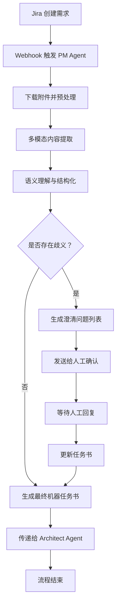

# PM Agent 详细设计文档

## 1. 概述
PM Agent 是研发交付智能体工作流平台的入口智能体，负责将非结构化的产品需求文档（PRD）或 Jira 需求描述转换为结构化的机器任务书（Machine Task Specification, MTS），为后续 Architect、Dev、QA 等 Agent 提供明确的执行依据。

## 2. 核心职责
- **需求解析**：从 Jira Webhook 接收非结构化需求文本
- **语义理解**：识别业务目标、功能范围、约束条件
- **结构化输出**：生成包含输入、输出、验收标准的机器任务书
- **歧义消除**：主动识别模糊描述并请求人工澄清
- **任务拆解**：将复杂需求拆分为可独立执行的子任务

## 3. 输入输出规范

### 3.1 输入
```json
{
  "jira_id": "PROJ-1234",
  "title": "用户登录增加短信验证码功能",
  "description": "原始需求文本（可能包含自然语言描述、截图链接、附件等）",
  "attachments": ["screenshot.png", "api_doc.pdf"],
  "priority": "HIGH",
  "reporter": "product_manager_001"
}
```

### 3.2 输出（机器任务书 MTS）
```json
{
  "task_id": "MTS-PROJ-1234-001",
  "source_jira": "PROJ-1234",
  "business_goal": "提升账户安全性，防止暴力破解",
  "functional_requirements": [
    {
      "id": "FR-001",
      "description": "用户在登录页面点击'获取验证码'按钮后，系统向绑定手机号发送6位数字验证码",
      "input": {"user_id": "string", "phone_number": "string"},
      "output": {"status": "success|failure", "message": "string"}
    },
    {
      "id": "FR-002", 
      "description": "用户输入验证码后，系统验证有效性（5分钟内有效，仅限一次使用）",
      "input": {"user_id": "string", "code": "string"},
      "output": {"valid": "boolean", "error_code": "string|null"}
    }
  ],
  "non_functional_requirements": [
    {"type": "performance", "spec": "验证码发送延迟 < 2秒 (P95)"},
    {"type": "security", "spec": "验证码尝试次数限制：5次/小时"},
    {"type": "compliance", "spec": "符合GDPR数据保护要求"}
  ],
  "acceptance_criteria": [
    "AC-001: 正确验证码允许登录",
    "AC-002: 错误验证码返回明确错误提示",
    "AC-003: 过期验证码自动失效",
    "AC-004: 频繁请求触发限流机制"
  ],
  "dependencies": [
    {"service": "SMS Gateway", "api": "/send", "version": "v2.1"},
    {"service": "User Database", "table": "users", "fields": ["phone_verified"]}
  ],
  "test_scenarios": [
    {"scenario": "正常流程", "steps": ["请求验证码", "输入正确码", "验证通过"]},
    {"scenario": "异常流程", "steps": ["请求验证码", "输入错误码", "验证失败"]}
  ],
  "ambiguities": [], // 如有歧义则列出，需人工澄清
  "confidence_score": 0.95, // 解析置信度
  "generated_at": "2024-01-15T10:30:00Z"
}
```

## 4. 技术架构

### 4.1 组件设计
```
┌─────────────────────────────────────────────┐
│           PM Agent 核心处理引擎              │
├─────────────────────────────────────────────┤
│  1. 需求接收器 (Requirement Receiver)        │
│     - Jira Webhook 监听                    │
│     - 附件下载与预处理                      │
├─────────────────────────────────────────────┤
│  2. 多模态解析器 (Multimodal Parser)         │
│     - 文本提取 (LLM + NLP)                 │
│     - 图像理解 (OCR + Vision Model)        │
│     - 文档解析 (PDF/Word 结构化)            │
├─────────────────────────────────────────────┤
│  3. 语义理解引擎 (Semantic Understanding)    │
│     - 意图识别 (Intent Classification)     │
│     - 实体抽取 (Entity Extraction)         │
│     - 关系建模 (Relationship Mapping)      │
├─────────────────────────────────────────────┤
│  4. 歧义检测器 (Ambiguity Detector)          │
│     - 模糊词识别 ("可能"、"大概"、"等")     │
│     - 逻辑冲突检测                         │
│     - 完整性校验                           │
├─────────────────────────────────────────────┤
│  5. 任务书生成器 (MTS Generator)             │
│     - 模板填充                             │
│     - 标准格式化                           │
│     - 置信度评估                           │
├─────────────────────────────────────────────┤
│  6. 人机协同接口 (Human-in-the-Loop)         │
│     - 歧义问题自动生成                     │
│     - 澄清请求发送给产品经理                │
│     - 迭代更新任务书                       │
└─────────────────────────────────────────────┘
```

### 4.2 技术栈选型
| 组件 | 技术方案 | 说明 |
|------|---------|------|
| LLM 基座 | GPT-4o / Claude 3.5 / Qwen-Max | 多模态理解能力强 |
| 向量数据库 | Pinecone / Milvus | 存储历史需求模式，用于 Few-shot 学习 |
| OCR 引擎 | Tesseract + Azure Form Recognizer | 处理截图中的文字 |
| 工作流引擎 | Temporal.io | 管理解析状态和重试逻辑 |
| 消息队列 | Kafka / RabbitMQ | 解耦 Jira 事件与处理逻辑 |

## 5. 处理流程

### 5.1 主流程


### 5.2 歧义处理子流程
```python
async def handle_ambiguities(requirement: dict, llm_client) -> dict:
    # Step 1: 识别模糊表述
    ambiguous_phrases = await llm_client.extract_ambiguous_terms(
        requirement["description"],
        patterns=["可能", "大概", "左右", "等", "优化", "提升"]
    )
    
    # Step 2: 生成澄清问题
    questions = []
    for phrase in ambiguous_phrases:
        question = await llm_client.generate_clarification_question(
            context=requirement["description"],
            ambiguous_term=phrase
        )
        questions.append(question)
    
    # Step 3: 如果存在歧义，暂停流程并通知人工
    if questions:
        await notify_product_manager(
            jira_id=requirement["jira_id"],
            questions=questions,
            deadline="24h"
        )
        return {"status": "pending_clarification", "questions": questions}
    
    return {"status": "ready", "questions": []}
```

## 6. 关键算法

### 6.1 需求结构化算法
```python
class RequirementStructurizer:
    def __init__(self, llm_model, vector_store):
        self.llm = llm_model
        self.vector_store = vector_store
    
    async def structure(self, raw_requirement: str) -> dict:
        # Step 1: 检索相似历史需求（Few-shot 学习）
        similar_examples = self.vector_store.search(
            query=raw_requirement,
            top_k=3,
            filter={"quality_score": {"$gte": 0.9}}
        )
        
        # Step 2: 构建 Prompt（包含示例）
        prompt = self._build_prompt(raw_requirement, similar_examples)
        
        # Step 3: LLM 推理
        structured_output = await self.llm.generate(
            prompt=prompt,
            response_format=MACHINE_TASK_SCHEMA  # JSON Schema 约束
        )
        
        # Step 4: 验证输出合规性
        validation_result = self._validate(structured_output)
        if not validation_result.is_valid:
            raise ValidationError(validation_result.errors)
        
        # Step 5: 计算置信度
        confidence = self._calculate_confidence(
            structured_output, 
            raw_requirement
        )
        
        structured_output["confidence_score"] = confidence
        return structured_output
    
    def _build_prompt(self, requirement: str, examples: list) -> str:
        return f"""
        你是一个专业的需求分析师。请将以下非结构化需求转换为机器任务书格式。
        
        参考示例（高质量历史需求）：
        {json.dumps(examples, indent=2)}
        
        待处理需求：
        {requirement}
        
        请严格按照以下 JSON Schema 输出：
        {MACHINE_TASK_SCHEMA_JSON}
        
        注意：
        1. 必须包含所有必填字段
        2. 验收标准必须可量化、可测试
        3. 如发现歧义，在 'ambiguities' 字段中标注
        """
```

### 6.2 置信度评估算法
```python
def calculate_confidence(structured_req: dict, raw_text: str) -> float:
    scores = []
    
    # 1. 完整性得分（必填字段是否齐全）
    completeness = len(structured_req.get("functional_requirements", [])) > 0
    scores.append(1.0 if completeness else 0.5)
    
    # 2. 一致性得分（输入输出是否匹配）
    consistency = check_io_consistency(structured_req)
    scores.append(consistency)
    
    # 3. 可测试性得分（验收标准是否可量化）
    testability = evaluate_testability(structured_req["acceptance_criteria"])
    scores.append(testability)
    
    # 4. 语义覆盖度（使用 Embedding 相似度）
    coverage = semantic_coverage(raw_text, structured_req)
    scores.append(coverage)
    
    # 加权平均
    weights = [0.3, 0.2, 0.2, 0.3]
    final_score = sum(s * w for s, w in zip(scores, weights))
    
    return round(final_score, 2)
```

## 7. 异常处理机制

| 异常类型 | 处理策略 | 升级路径 |
|---------|---------|---------|
| 附件无法解析 | 重试 3 次 → 记录日志 → 继续处理文本部分 | 通知运维检查存储服务 |
| LLM 超时 | 指数退避重试（1s, 2s, 4s） | 切换备用模型 |
| 输出格式不合法 | 自动修复尝试 → 重新生成 | 标记为低置信度，需人工审核 |
| 检测到高危需求（如涉及资金） | 强制人工审批 | 直接升级到安全团队 |
| 歧义过多（>5 个） | 暂停流程，要求重写需求 | 通知产品负责人 |

## 8. 性能指标（SLA）

| 指标 | 目标值 | 测量方式 |
|------|-------|---------|
| 平均处理时长 | < 30 秒 | 从 Webhook 接收到 MTS 生成完成 |
| 歧义识别准确率 | > 90% | 人工抽检 |
| 结构化输出合格率 | > 95% | Schema 验证通过率 |
| 置信度 > 0.8 占比 | > 85% | 统计分析 |
| 人工介入率 | < 15% | 需要澄清的需求比例 |

## 9. 与下游 Agent 的协作协议

### 9.1 传递给 Architect Agent
```json
{
  "event_type": "REQUIREMENT_READY",
  "payload": { /* 完整的机器任务书 */ },
  "metadata": {
    "next_agent": "ARCHITECT",
    "timeout": "5min",
    "retry_policy": {"max_attempts": 3}
  }
}
```

### 9.2 反馈循环
- Architect Agent 如发现需求不可实现，可回退到 PM Agent 请求调整
- QA Agent 在生成测试用例时如发现验收标准不明确，可触发重新解析

## 10. 演进路线

### Phase 1（MVP）
- 支持纯文本需求解析
- 基础歧义检测
- 简单 JSON 输出

### Phase 2（增强）
- 多模态支持（截图、PDF）
- 历史需求学习（向量检索）
- 自动澄清工作流

### Phase 3（智能化）
- 需求质量评分与建议
- 跨需求依赖自动发现
- 基于业务目标的反向优化建议

## 11. 监控与可观测性

### 关键埋点
```python
# 解析开始
metrics.increment("pm_agent.parse.started", tags={"jira_id": jira_id})

# 各阶段耗时
timing.record("pm_agent.stage.multimodal_parse", duration_ms)
timing.record("pm_agent.stage.semantic_understand", duration_ms)
timing.record("pm_agent.stage.mts_generation", duration_ms)

# 质量指标
histogram.observe("pm_agent.confidence_score", confidence)
counter.increment("pm_agent.ambiguities.detected", count=len(ambiguities))

# 异常监控
if confidence < 0.6:
    metrics.increment("pm_agent.low_confidence.alert")
```

### Dashboard 指标
- 实时处理吞吐量（req/min）
- 平均置信度趋势图
- 歧义类型分布饼图
- 人工介入率周报

---

*文档版本：v1.0*  
*最后更新：2024-01-15*  
*作者：系统架构团队*
