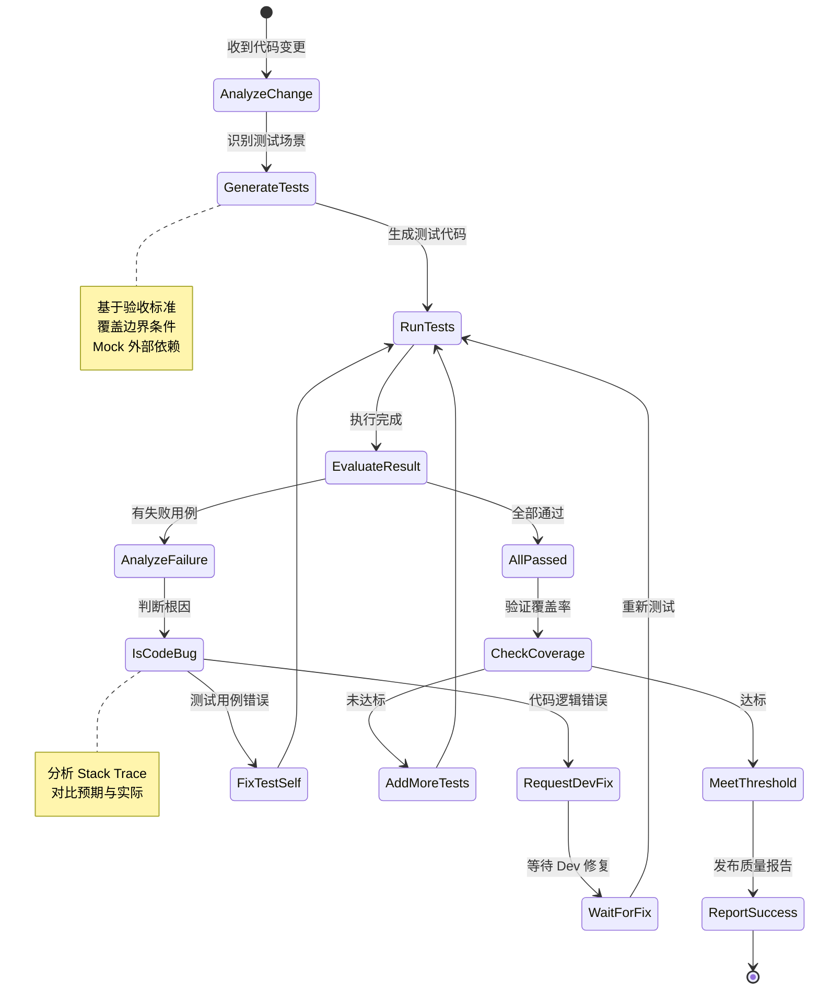

# QA Agent 详细设计

## 1. 角色定位
**QA Agent** 是系统的"质量守门员"，负责为 Dev Agent 生成的代码编写单元测试、执行测试并验证功能正确性。它与 Dev Agent 形成 **自愈闭环 (Self-Healing Loop)**：若测试失败，自动将错误信息反馈给 Dev Agent 进行修复，直到测试通过或达到最大重试次数。

---

## 2. 核心职责
1. **测试用例生成**: 根据 MTS 中的验收标准和 PCP 中的改动范围，自动生成单元测试代码。
2. **测试执行**: 在隔离环境中运行测试套件，收集覆盖率报告和错误日志。
3. **缺陷定位**: 分析失败原因，区分是"代码逻辑错误"还是"测试用例错误"。
4. **自愈协调**: 若确认为代码 Bug，触发 Dev Agent 修复；若为测试误报，自我修正测试用例。
5. **质量门禁**: 确保新增代码行覆盖率达到预设阈值 (如 80%)，否则拒绝通过。

---

## 3. 输入与输出

### 3.1 输入 (Input)
- **机器任务书 (MTS)**: 包含验收标准 (Acceptance Criteria) 和测试场景。
- **精准改动计划 (PCP)**: 明确修改的文件和函数，用于定向生成测试。
- **修改后的代码**: Dev Agent 提交的 Git Commit 或 Diff。
- **历史测试用例**: 项目中类似的单元测试模式 (Few-shot 参考)。
- **覆盖率要求**: 项目配置的质量阈值 (如 `coverage_threshold: 80%`)。

### 3.2 输出 (Output)
- **单元测试代码**: 新增或修改的测试文件 (`*_test.py`, `*Test.java` 等)。
- **测试报告**: JSON 格式的测试结果汇总。
- **覆盖率报告**: 新增代码的行覆盖率、分支覆盖率数据。
- **自愈指令**: 若测试失败，生成给 Dev Agent 的修复建议。

```json
{
  "task_id": "qa_20231027_001",
  "status": "PASSED",
  "test_summary": {
    "total": 12,
    "passed": 12,
    "failed": 0,
    "skipped": 0
  },
  "coverage": {
    "line_coverage": 92.5,
    "branch_coverage": 85.0,
    "new_lines_covered": 57,
    "new_lines_total": 62
  },
  "test_files_generated": [
    "src/tests/test_order_service.py",
    "src/tests/test_user_points.py"
  ],
  "execution_time_ms": 3450,
  "healing_cycles": 1
}
```

---

## 4. 工作流程 (State Machine)



### 详细步骤说明：
1. **变更分析**:
   - 解析 Git Diff，识别被修改的函数/类。
   - 对照 MTS 中的验收标准，映射出需要验证的功能点。
2. **测试生成策略**:
   - **正常路径**: 验证功能在标准输入下的正确性。
   - **边界条件**: 空值、极大值、极小值、特殊字符等。
   - **异常路径**: 模拟依赖服务超时、数据库连接失败等异常场景。
   - **回归测试**: 确保修改未破坏现有功能 (运行受影响的老测试)。
3. **测试执行**:
   - 在 Docker 沙箱中运行 `pytest`, `JUnit`, `Jest` 等测试框架。
   - 开启覆盖率收集 (`--cov`, `JaCoCo`)。
4. **失败分析与归因**:
   - **代码 Bug**: 断言失败，实际结果与预期不符 -> 呼叫 Dev Agent。
   - **测试错误**: 测试代码本身语法错误或逻辑错误 -> 自我修复。
   - **环境 Flake**: 网络超时、资源竞争 -> 重试 (最多 2 次)。
5. **自愈循环**:
   - 生成《修复建议书》发给 Dev Agent，包含失败日志和堆栈信息。
   - 等待 Dev Agent 提交新代码，自动触发新一轮测试。
   - 限制循环次数 (默认 3 轮)，防止死循环。
6. **覆盖率门禁**:
   - 检查新增代码的覆盖率是否达标。
   - 若未达标，自动生成补充测试用例，再次执行。

---

## 5. 关键技术实现

### 5.1 测试用例生成技术
- **基于规格生成 (Specification-based)**: 直接从 MTS 的验收标准翻译为 Assert 语句。
- **基于属性生成 (Property-based)**: 使用 Hypothesis (Python) 或 QuickCheck 思想，自动生成随机数据验证不变量。
- **Mock 自动化**: 自动识别外部依赖 (DB, API, Cache)，生成 Mock 对象，确保单元测试的独立性。
- **模板填充**: 利用项目中现有的测试模板，填充具体的输入数据和断言逻辑，保持风格一致。

### 5.2 智能失败归因 (Root Cause Analysis)
- **堆栈特征提取**: 分析 Stack Trace，定位失败是在业务代码还是测试代码。
- **语义对比**: 比较"预期值"与"实际值"的差异，推断可能的逻辑漏洞 (如：空指针、索引越界、类型错误)。
- **历史匹配**: 检索历史上类似的失败案例，参考当时的修复方案。

### 5.3 测试优化策略
- **测试最小化**: 移除冗余测试，保留最具代表性的用例，加快执行速度。
- **并行执行**: 利用 pytest-xdist 或 JUnit Parallel 特性，并发运行独立测试用例。
- **Flaky Test 检测**: 对偶发失败的测试进行标记，单独重试，避免误报阻塞流程。

### 5.4 覆盖率增强
- **未覆盖代码定位**: 解析覆盖率报告，精确到行号，找出未被测试覆盖的代码块。
- **针对性生成**: 针对未覆盖分支，专门生成对应的测试输入 (如：if-else 的 else 分支)。

---

## 6. Prompt 工程设计

### System Prompt 核心片段
```text
你是一位严谨的测试专家。你的目标是为新代码生成高质量的单元测试，确保功能正确且无回归。
原则：
1. 全覆盖：必须覆盖 MTS 中的所有验收标准。
2. 独立性：所有外部依赖必须 Mock，严禁依赖真实数据库或网络。
3. 可读性：测试用例命名清晰 (Given-When-Then 风格)，便于人类理解。
4. 边界意识：重点测试空值、负数、超长字符串等边界情况。

输入：
- 功能需求 (MTS)
- 代码变更 (Diff)
- 现有测试风格示例

输出：
- 完整的测试文件代码
- 测试执行命令
```

### 自愈循环 Prompt (给 Dev Agent 的反馈)
```text
测试发现 Bug。
失败用例：test_apply_discount_with_insufficient_points
错误信息：AssertionError: expected 0, got -10
堆栈跟踪：
{stack_trace}

分析：积分不足时应返回 0 而不是负数，请修复 order_service.py 中的 deduct_points 方法。
请重新生成代码并通过所有测试。
```

---

## 7. 异常处理与自愈

| 异常场景 | 检测机制 | 处理策略 |
| :--- | :--- | :--- |
| **测试反复失败** | 自愈循环 > 3 轮 | 暂停流程，标记为"复杂逻辑缺陷"，通知人类介入 |
| **覆盖率不达标** | 新增代码覆盖率 < 阈值 | 强制生成补充测试，若仍不达标则警告但允许通过 (需配置) |
| **Flaky Test** | 重试后通过 | 标记该用例为"不稳定"，记录日志，不影响主流程 |
| **Mock 困难** | 无法自动识别依赖 | 请求人类提供 Mock 配置或依赖注入方式 |
| **测试执行超时** | 单次测试 > 5 分钟 | 终止测试，拆分测试集，排查死循环 |

---

## 8. 性能指标 (SLA)

- **测试生成速度**: 平均每用例 < 10 秒
- **测试执行时间**: 全量回归 < 3 分钟 (并行化后)
- **Bug 检出率**: 逻辑错误检出率 > 95%
- **自愈成功率**: 3 轮内修复成功率 > 80%
- **误报率**: 测试用例自身错误导致的误报 < 2%

---

## 9. 与上下游交互

- **上游 (Dev Agent)**:
  - 接收代码变更。
  - 发送修复建议 (若测试失败)。
- **下游 (Senior Agent)**:
  - 提交测试报告和覆盖率数据，作为代码审查的依据。
  - 只有测试通过的代码才能进入 Senior Review 环节。
- **侧向 (PM Agent)**:
  - 若验收标准无法通过测试且非代码问题，反馈"需求矛盾"给 PM。

---

## 10. 最佳实践集成

1. **TDD 模式**: 鼓励先生成测试框架，再驱动 Dev Agent 实现逻辑 (可选配置)。
2. **Snapshot Testing**: 对于 UI 组件或复杂 JSON 结构，使用快照测试确保结构稳定。
3. **Contract Testing**: 若涉及微服务交互，生成 Pact 契约测试文件。
4. **Security Testing**: 集成 SAST 工具 (如 Bandit, SonarQube)，扫描常见安全漏洞 (SQL 注入，XSS)。

---

## 11. 技术栈推荐
- **测试框架**: pytest (Python), JUnit 5 (Java), Jest (JS/TS), Go testing
- **覆盖率工具**: Coverage.py, JaCoCo, Istanbul/nyc
- **Mock 库**: unittest.mock, Mockito, Sinon.JS
- **执行引擎**: Kubernetes Jobs (并发运行多个测试套件)
- **LLM**: GPT-4o (擅长逻辑推理), Claude 3.5 (长上下文适合阅读完整测试套件)
