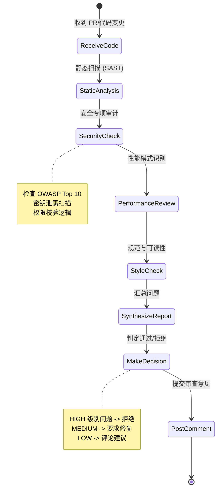
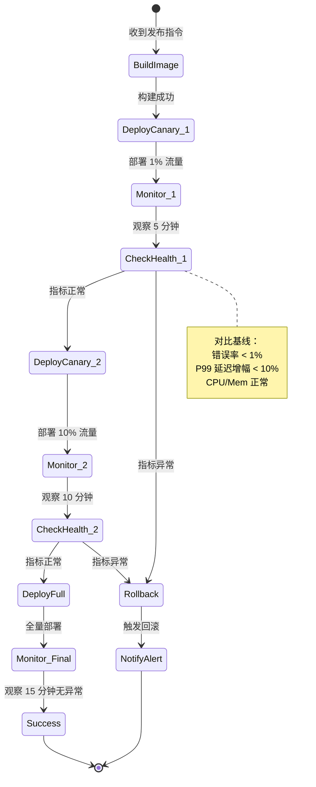

# Senior Agent & DevOps Agent 详细设计

## 第一部分：Senior Agent (代码审查专家)

### 1. 角色定位
**Senior Agent** 是系统的"技术把关人"，模拟资深工程师/架构师的 Code Review 过程。它不只关注代码是否正确，更关注**安全性、可维护性、性能、设计规范**等非功能性指标。只有通过 Senior Agent 审查的代码，才能进入发布流程。

---

### 2. 核心职责
1. **安全审计**: 检测 SQL 注入、XSS、CSRF、硬编码密钥、权限漏洞等安全问题。
2. **规范检查**: 验证代码是否符合团队编码规范、设计原则 (SOLID)、架构约束。
3. **性能评估**: 识别潜在的性能瓶颈 (如 N+1 查询、内存泄漏风险、未加锁的并发)。
4. **可读性审查**: 检查命名清晰度、注释完整性、函数复杂度 (Cyclomatic Complexity)。
5. **技术债务预警**: 识别临时方案 (TODO/FIXME)、过度设计、重复代码。
6. **最终决策**: 给出 `APPROVE`, `REQUEST_CHANGES`, 或 `COMMENT` 的审查结论。

---

### 3. 输入与输出

#### 3.1 输入 (Input)
- **代码 Diff**: Git 变更片段 (上下文各 5 行)。
- **完整文件内容**: 对于重大修改，读取整个文件以理解上下文。
- **测试报告**: QA Agent 生成的测试结果和覆盖率数据。
- **精准改动计划 (PCP)**: 用于核对实现是否符合设计意图。
- **安全规范库**: 项目特定的安全红线 (如：禁止明文存储密码)。
- **历史审查案例**: 历史上被标记为"高风险"的代码模式。

#### 3.2 输出 (Output) - 《代码审查报告》
```json
{
  "review_id": "senior_20231027_001",
  "decision": "REQUEST_CHANGES",
  "summary": "代码逻辑正确，但存在 2 个安全隐患和 1 个性能问题",
  "issues": [
    {
      "type": "SECURITY",
      "severity": "HIGH",
      "file": "src/api/user_api.py",
      "line": 45,
      "message": "检测到 SQL 拼接风险，建议使用参数化查询",
      "suggestion": "将 f\"SELECT * FROM users WHERE id={user_id}\" 改为 parameterized query"
    },
    {
      "type": "PERFORMANCE",
      "severity": "MEDIUM",
      "file": "src/services/order_service.py",
      "line": 89,
      "message": "循环内执行数据库查询 (N+1 问题)",
      "suggestion": "使用批量查询 (IN clause) 替代循环单条查询"
    },
    {
      "type": "CODE_STYLE",
      "severity": "LOW",
      "file": "src/models/user_points.py",
      "line": 12,
      "message": "函数名不符合驼峰命名规范",
      "suggestion": "将 'get_user_points' 改为 'getUserPoints' (根据项目规范)"
    }
  ],
  "positive_feedback": [
    "单元测试覆盖率高，边界条件处理得当",
    "异常处理逻辑清晰，符合项目规范"
  ],
  "technical_debt_added": 2,
  "estimated_review_time_min": 5
}
```

---

### 4. 工作流程



### 关键步骤说明：
1. **静态分析集成**: 调用 SonarQube, ESLint, Pylint 等工具获取基础指标。
2. **语义级安全审计**:
   - LLM 深入理解数据流，检测工具难以发现的逻辑漏洞 (如：越权访问)。
   - 检查敏感操作是否有日志审计。
3. **性能模式匹配**:
   - 识别常见反模式：大对象循环创建、同步 IO 阻塞异步流程、未分页的大查询。
4. **上下文感知审查**:
   - 对比 PCP，确认没有"过度实现"或"偏离设计"。
   - 检查是否引入了不必要的依赖。
5. **分级决策**:
   - **BLOCKER/HIGH**: 直接拒绝，必须修复。
   - **MEDIUM**: 建议修复，可特批。
   - **LOW/INFO**: 仅评论，不阻塞。

---

### 5. Prompt 工程设计

#### System Prompt 核心片段
```text
你是一位拥有 15 年经验的技术专家，负责代码审查 (Code Review)。
你的目标是确保代码安全、高效、可维护。
审查维度：
1. 安全性 (最高优先级): SQL 注入、XSS、认证授权、数据泄露。
2. 性能: 时间复杂度、数据库查询效率、并发安全。
3. 可维护性: 命名清晰、单一职责、错误处理、测试覆盖。
4. 一致性: 符合项目现有风格和架构规范。

输出要求：
- 语气专业且建设性，避免指责。
- 每个问题必须提供具体的修复建议代码示例。
- 区分问题严重程度 (HIGH/MEDIUM/LOW)。
```

---

### 6. 技术栈推荐
- **静态分析**: SonarQube, Semgrep (自定义规则), Bandit, ESLint
- **LLM**: Claude 3.5 Sonnet (长上下文适合全文件审查), GPT-4o
- **集成**: GitHub/GitLab API (直接提交 Review Comment)

---

## 第二部分：DevOps Agent (发布与运维专家)

### 1. 角色定位
**DevOps Agent** 是系统的"发布指挥官"，负责将通过审查的代码安全、平滑地部署到生产环境。它实施**灰度发布策略**，实时监控应用健康度，并具备**自动回滚**能力，确保发布零故障。

---

### 2. 核心职责
1. **构建管理**: 触发 CI 流水线，生成 Docker 镜像，推送至镜像仓库。
2. **灰度发布**: 实施 Canary Release 或 Blue-Green Deployment，逐步放量。
3. **实时监控**: 采集发布后的关键指标 (QPS, 延迟，错误率，资源使用率)。
4. **异常检测**: 基于基线对比，自动识别发布引起的性能退化或错误激增。
5. **自动回滚**: 一旦检测到严重异常，立即触发回滚，恢复上一稳定版本。
6. **发布报告**: 生成发布总结，记录版本信息、变更内容、监控数据。

---

### 3. 输入与输出

#### 3.1 输入 (Input)
- **审查通过的代码**: Senior Agent 标记为 `APPROVED` 的 Commit。
- **发布策略配置**: 灰度比例 (1% -> 5% -> 20% -> 100%)、观察窗口时间。
- **监控指标基线**: 历史正常时段的 QPS、P99 延迟、错误率阈值。
- **K8s 集群信息**: 目标命名空间、服务名称、副本数。

#### 3.2 输出 (Output) - 《发布报告》
```json
{
  "deployment_id": "deploy_20231027_001",
  "version": "v1.2.3",
  "status": "COMPLETED",
  "strategy": "CANARY",
  "stages": [
    {"phase": "1%", "status": "PASSED", "duration_sec": 300, "error_rate": 0.01},
    {"phase": "10%", "status": "PASSED", "duration_sec": 600, "error_rate": 0.02},
    {"phase": "100%", "status": "PASSED", "duration_sec": 900, "error_rate": 0.015}
  ],
  "metrics_comparison": {
    "latency_p99_change": "+2%",
    "error_rate_change": "-0.01%",
    "cpu_usage_change": "+5%"
  },
  "rollback_triggered": false,
  "completion_time": "2023-10-27T14:30:00Z"
}
```

---

### 4. 工作流程 (灰度发布状态机)



### 关键步骤说明：
1. **自动化构建**:
   - 执行 `docker build`, `docker push`。
   - 生成 SBOM (软件物料清单)，记录依赖成分。
2. **渐进式发布**:
   - **阶段 1 (1%)**: 仅内部用户或特定 Header 流量，验证基本功能。
   - **阶段 2 (10%-20%)**: 小比例公网流量，观察错误率和性能。
   - **阶段 3 (100%)**: 全量切换，完成发布。
3. **智能监控**:
   - 实时采集 Prometheus 指标。
   - 对比发布前后窗口期 (如 5 分钟) 的数据变化。
   - 检测黄金指标 (Golden Signals): 延迟、流量、错误、饱和度。
4. **自动回滚机制**:
   - 触发条件：错误率 > 阈值、P99 延迟翻倍、Pod 频繁重启。
   - 动作：K8s `rollout undo`，切换流量回旧版本，发送告警。

---

### 5. 关键技术实现

#### 5.1 灰度流量调度
- **Service Mesh (Istio)**: 通过 VirtualService 精确控制流量比例，无需修改代码。
- **Ingress Controller**: 基于 Nginx/AWS ALB 的权重路由。
- **Feature Flags**: 结合 LaunchDarkly 等工具，按用户 ID 动态开关功能。

#### 5.2 异常检测算法
- **静态阈值**: 错误率 > 1%, P99 > 500ms。
- **动态基线**: 对比上周同日同时段数据，偏差超过 20% 即告警。
- **趋势预测**: 使用简单线性回归预测未来 5 分钟趋势，提前拦截恶化。

#### 5.3 回滚策略
- **快速回滚**: 保留旧版本 ReplicaSet，秒级切换。
- **数据兼容性**: 确保数据库迁移 (Migration) 向下兼容，防止回滚后数据无法读取。
- **通知机制**: 回滚同时调用 PagerDuty/钉钉/企微 API，通知值班人员。

---

### 6. Prompt 工程设计 (用于分析监控数据)

```text
你是一位 SRE 专家。请分析以下发布前后的监控数据：
- 发布前 (5 分钟): 错误率 0.05%, P99 延迟 120ms
- 发布后 (5 分钟): 错误率 0.8%, P99 延迟 350ms

阈值标准：错误率 < 0.5%, P99 增幅 < 50%

判断：发布是否成功？是否需要回滚？
请给出明确的决策 (PROCEED / ROLLBACK) 并说明理由。
```

---

### 7. 性能指标 (SLA)

- **发布时长**: 全量发布 < 15 分钟 (含观察窗口)
- **回滚速度**: 从决策到流量切回 < 30 秒
- **故障发现时间 (MTTD)**: < 1 分钟
- **发布成功率**: > 98% (指无需人工介入的回滚)
- **资源开销**: 灰度期间额外资源消耗 < 10%

---

### 8. 与上下游交互

- **上游 (Senior Agent)**:
  - 只有 `APPROVED` 的代码才能触发 DevOps 流程。
- **下游 (监控系统)**:
  - 对接 Prometheus, Grafana, Datadog。
  - 对接 K8s API Server。
- **侧向 (PM/Dashboard)**:
  - 发布完成后更新 Jira 状态为 "Done"。
  - 发送发布通知到 Slack/钉钉群。

---

### 9. 技术栈推荐
- **CI/CD**: ArgoCD, Tekton, GitHub Actions
- **容器编排**: Kubernetes, Helm
- **服务网格**: Istio, Linkerd (用于精细流量控制)
- **监控**: Prometheus, Grafana, ELK Stack
- **告警**: Alertmanager, PagerDuty

---

## 总结：Senior & DevOps 协同效应

| 特性 | Senior Agent | DevOps Agent |
| :--- | :--- | :--- |
| **关注点** | 代码质量、安全、规范 | 发布安全、系统稳定性、监控 |
| **介入时机** | 代码合并前 (Pre-Merge) | 代码合并后 (Post-Merge) |
| **核心能力** | 静态分析、语义理解 | 流量调度、指标分析、自动化运维 |
| **失败后果** | 阻止低质代码入库 | 自动回滚，防止故障扩大 |
| **共同目标** | **零缺陷交付** | **零故障发布** |

两者共同构成了系统的"双保险"机制：Senior Agent 确保**代码本身没问题**，DevOps Agent 确保**运行环境没问题**，即使有漏网之鱼也能在影响扩大前自动止损。
