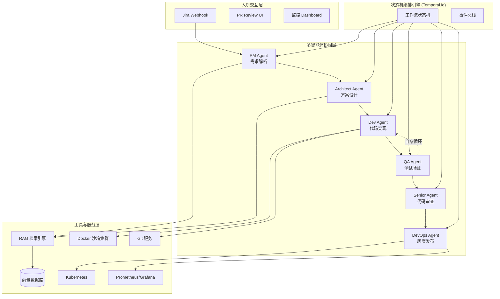
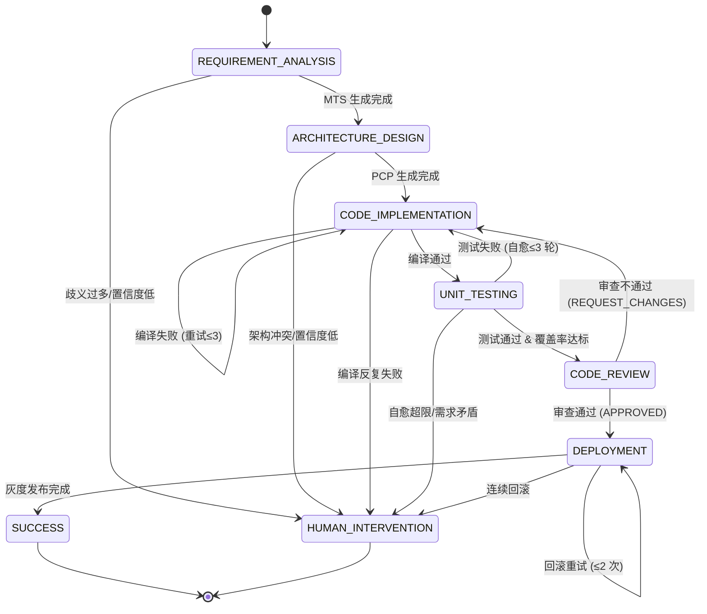
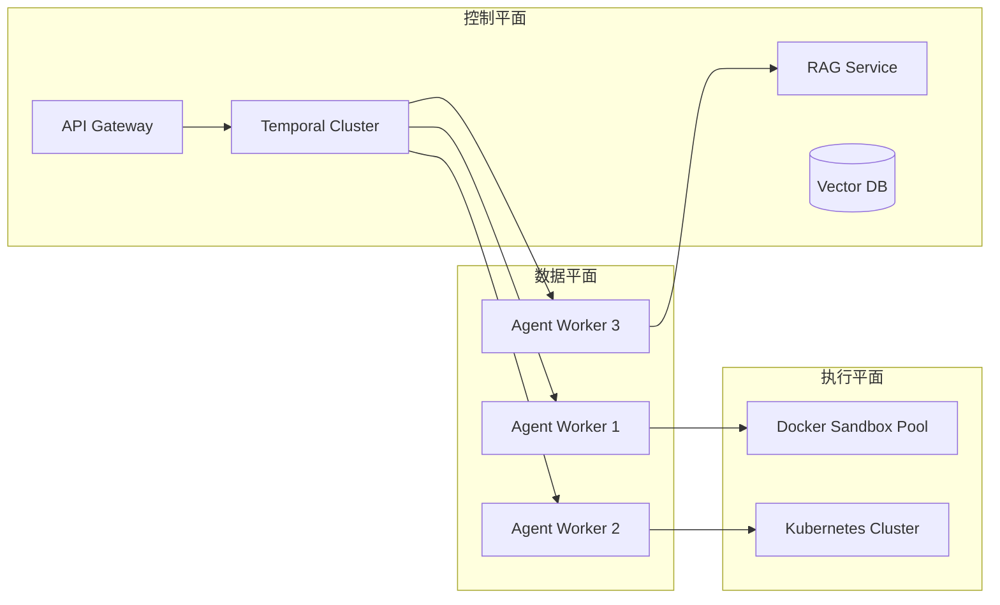

# 系统总体架构设计文档

## 1. 系统概述

本系统是一个**研发交付智能体工作流平台 (Agentic CI/CD)**，通过 6 大核心 Agent 协同工作，实现从需求到发布的端到端自动化。系统采用**状态机驱动**的架构，替代传统线性流水线，支持自愈循环和动态推理。

---

## 2. 整体架构图



---

## 3. 六大智能体职责矩阵

| Agent | 角色定位 | 核心输入 | 核心输出 | 关键能力 | SLA |
| :--- | :--- | :--- | :--- | :--- | :--- |
| **PM Agent** | 需求翻译官 | Jira 描述/截图/PDF | 机器任务书 (MTS) | 歧义检测、置信度评估 | <30 秒 |
| **Architect Agent** | 技术大脑 | MTS + 代码库索引 | 精准改动计划 (PCP) | RAG 检索、影响面分析 | <45 秒 |
| **Dev Agent** | 代码执行者 | PCP + 源代码 | Git Commit + 编译报告 | AST 修改、编译自愈 | 编译通过率>98% |
| **QA Agent** | 质量守门员 | 代码变更 + 验收标准 | 测试报告 + 覆盖率 | 用例生成、缺陷归因 | Bug 检出率>95% |
| **Senior Agent** | 技术把关人 | Diff + 测试报告 | 审查报告 (Approve/Reject) | 安全审计、性能评估 | 高危漏洞检出率 100% |
| **DevOps Agent** | 发布指挥官 | 审查通过代码 | 发布报告 + 监控数据 | 灰度发布、自动回滚 | 回滚速度<30 秒 |

---

## 4. 核心工作流程

### 4.1 标准成功路径
```
需求提交 → PM 解析 → 架构设计 → 代码实现 → 测试通过 → 审查通过 → 灰度发布 → 完成
```

### 4.2 自愈循环路径
```
测试失败 → QA 分析 → Dev 修复 → 重新测试 → (循环最多 3 次) → 通过/人工介入
```

### 4.3 异常终止路径
```
任何阶段置信度低/反复失败 → 挂起任务 → 通知人类 → 人工处理 → 恢复流程
```

---

## 5. 状态机设计

系统采用 **Temporal.io** 作为工作流引擎，定义以下核心状态：



---

## 6. 数据流转设计

### 6.1 核心数据结构

#### 机器任务书 (MTS)
```json
{
  "task_id": "jira-12345",
  "business_goal": "...",
  "functional_requirements": [...],
  "acceptance_criteria": [...],
  "ambiguities": [...],
  "confidence_score": 0.92
}
```

#### 精准改动计划 (PCP)
```json
{
  "plan_id": "arch_001",
  "changes": [
    {"file_path": "...", "action": "MODIFY", "target_scope": [...]}
  ],
  "risk_analysis": [...],
  "confidence_score": 0.88
}
```

#### 审查报告
```json
{
  "review_id": "senior_001",
  "decision": "APPROVE",
  "issues": [...],
  "positive_feedback": [...]
}
```

### 6.2 向量数据库 Schema
```json
{
  "id": "uuid",
  "content": "代码片段/需求文本",
  "embedding": [0.1, 0.2, ...],
  "metadata": {
    "type": "code|requirement|test",
    "file_path": "...",
    "function_name": "...",
    "project": "...",
    "last_updated": "timestamp"
  }
}
```

---

## 7. 技术栈总览

| 层级 | 组件 | 选型 |
| :--- | :--- | :--- |
| **工作流引擎** | 状态机编排 | Temporal.io |
| **Agent 框架** | 多智能体协同 | LangGraph / AutoGen |
| **LLM** | 推理核心 | GPT-4o / Claude 3.5 Sonnet |
| **RAG** | 向量检索 | Pinecone / Milvus + Cross-Encoder |
| **代码解析** | AST 分析 | Tree-sitter (多语言) |
| **沙箱环境** | 代码执行 | Docker + Kubernetes Jobs |
| **CI/CD** | 发布部署 | ArgoCD + Istio |
| **监控** | 指标采集 | Prometheus + Grafana |
| **代码托管** | Git 操作 | GitHub/GitLab API |
| **项目管理** | 需求对接 | Jira Webhook |

---

## 8. 安全与合规设计

### 8.1 代码安全
- **密钥扫描**: 所有提交前自动运行 git-secrets
- **SAST**: 集成 SonarQube/Semgrep 进行静态分析
- **依赖检查**: 禁止 GPL 协议，扫描 CVE 漏洞

### 8.2 运行时安全
- **沙箱隔离**: Docker 容器限制 CPU/Mem，网络隔离
- **权限最小化**: K8s ServiceAccount 最小权限原则
- **审计日志**: 所有 Agent 操作全量留痕

### 8.3 数据安全
- **向量库加密**: Embedding 数据存储加密
- **敏感信息脱敏**: LLM 输入前自动脱敏用户数据
- **访问控制**: RBAC 权限管理

---

## 9. 可扩展性设计

### 9.1 水平扩展
- **无状态 Agent**: 所有 Agent 设计为无状态，可横向扩容
- **消息队列**: 任务通过队列分发，支持高并发
- **向量库分片**: 支持 PB 级代码库索引

### 9.2 垂直扩展
- **插件化架构**: 新增语言支持只需添加对应 Parser 和 Linter
- **可配置策略**: 发布策略、测试阈值均可通过配置文件调整
- **多租户支持**: 命名空间隔离，支持多项目并行

---

## 10. 监控与可观测性

### 10.1 核心指标
- **吞吐量**: 每日处理需求数、代码生成行数
- **质量**: 一次性通过率、Bug 逃逸率、回滚率
- **效率**: 平均交付周期 (Lead Time)、各阶段耗时
- **成本**: Token 消耗量、沙箱资源使用率

### 10.2 告警策略
- **流程阻塞**: 任务挂起超过 30 分钟
- **质量下降**: 连续 3 个任务测试失败
- **资源异常**: 沙箱 CPU/Mem 使用率 > 90%
- **安全事件**: 检测到密钥泄露或高危漏洞

---

## 11. 部署架构



---

## 12. 实施路线图

### Phase 1: 基础能力建设 (4-6 周)
- [ ] 搭建 Temporal 工作流引擎
- [ ] 实现 PM Agent 和 Architect Agent
- [ ] 构建代码库向量化 pipeline
- [ ] 开发 Docker 沙箱基础镜像

### Phase 2: 核心闭环打通 (6-8 周)
- [ ] 实现 Dev Agent 和 QA Agent
- [ ] 打通自愈循环机制
- [ ] 集成单元测试框架
- [ ] 实现 Senior Agent 基础审查

### Phase 3: 发布与运维自动化 (4-6 周)
- [ ] 实现 DevOps Agent
- [ ] 集成 ArgoCD 和 Istio
- [ ] 建立监控告警体系
- [ ] 完善自动回滚机制

### Phase 4: 优化与规模化 (持续)
- [ ] 性能优化 (减少 Token 消耗、加快响应)
- [ ] 扩展多语言支持
- [ ] 引入强化学习优化 Agent 决策
- [ ] 建设可视化 Dashboard

---

## 13. 风险与应对

| 风险 | 影响 | 应对措施 |
| :--- | :--- | :--- |
| **LLM 幻觉** | 生成错误代码或设计 | 多层校验机制 + 人工介入阈值 |
| **自愈死循环** | 资源浪费、流程阻塞 | 限制重试次数 + 超时熔断 |
| **安全风险** | 代码漏洞、密钥泄露 | SAST 扫描 + 密钥检测 + 沙箱隔离 |
| **性能瓶颈** | 大规模代码库检索慢 | 向量库分片 + 增量索引 + 缓存 |
| **接受度低** | 团队不信任 AI 生成代码 | 渐进式推广 + 人工审批开关 + 透明化日志 |

---

## 14. 总结

本系统通过**状态机驱动的多智能体协同**，实现了软件研发交付的全流程自动化。核心创新点包括：

1. **自愈循环**: QA 与 Dev 形成闭环，自动修复 Bug
2. **精准改动**: RAG+ 架构师 Agent 确保最小化修改
3. **灰度发布**: DevOps Agent 实现零故障发布
4. **人类角色转变**: 从"写代码 + 排错"变为"定目标 + 审批"

系统设计遵循**安全优先、渐进式自动化、可观测性强**的原则，可作为企业级 Agentic CI/CD 平台的参考架构。
